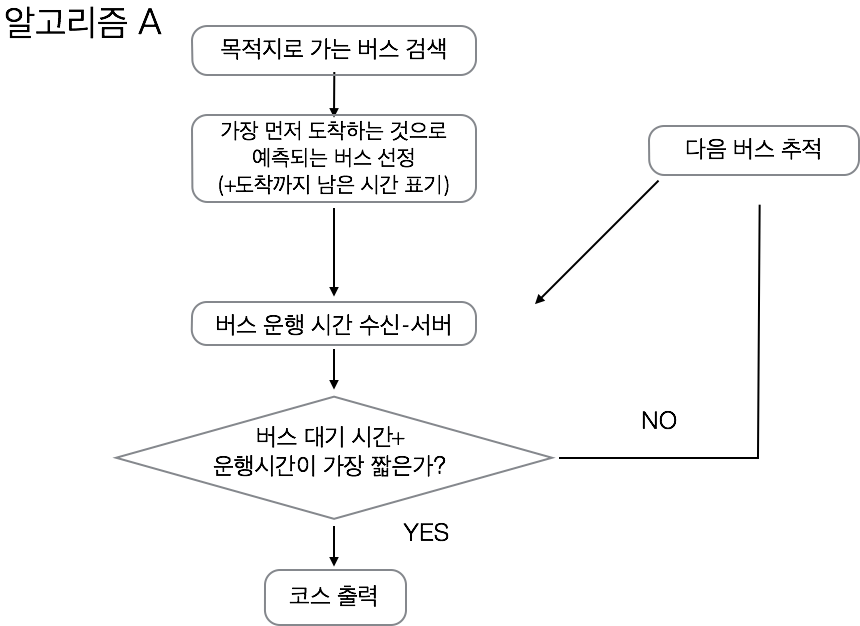
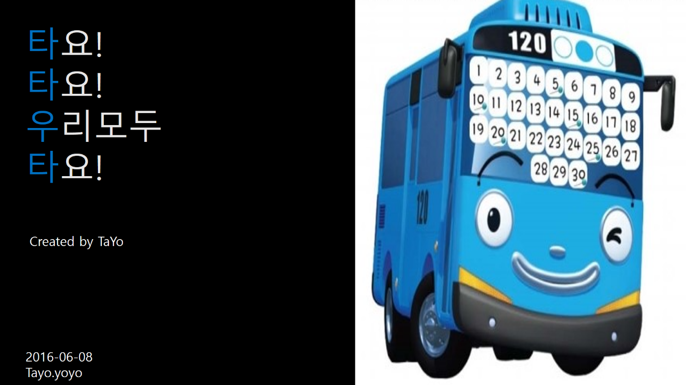

=========================

koreatech lee kyu young
------------------
> ** introduce my self **
> - 2015136089
> * hometown *
> - [leekyuyoung](http://naver.com)

[koreatech][homepage]
[homepage]:http://koreatech.ac.kr/

`code.[test](http://test.net)
 
| a | b | c | d |
| ----- | ------- | ------ | ------ |
| 1 | 2 | 3 | 4 |

| Item     | Value | Qty   |
| :------- | ----: | :---: |
| OSC | $600 |  3   |
| Reverb    | $120   |  2   |
| Filter   | $310    |  2  |

## 7. 시스템의 구성 요소 및 기능 구성 ##
1)	시스템의 구성 요소
>-	QR코드 or NFC
>-	GPS
>-	WIFI/셀룰러 데이터
>-	App

2)	기능 구성
>-	QR코드 or NFC : 정류소에 체크포인트, 즉 쉽게 얘기하자면 스탬프 투어처럼 핸드폰을 NFC 기능을 이용해 장소를 인식시키면 주변 상황에 >-대하여 알려줍니다. 주변 대중교통의 현 상황을 실시간으로 알려줍니다. 올바르게 가고 있는지 중간점검을 하는 
>-역할을 합니다.

>-	GPS & WIFI : GPS를 통하여 현재 나의 위치를 알 수 있고 WIFI를 통하여 더욱 정확한 위치 인식이 가능합니다.
>-	App : (앱의 기능을 부분화 및 세분화)
>-	NFC 데이터 송수신 대중교통 실시간 정보+노선도
>-	Gps위치 송수신 – 자신의 현 위치를 좌표로 받는다.
>-	스크린 – gps를 기반 지도에 사용자의 위치를 출력함
>-	최적의 루트 계산 – 버스대기시간 + 버스탑승시간이 가장 적은 루트로 지정하는 알고리즘
>- (+권한 획득)
>- -참조-
>- 구글지도
>- 네이버지도 - 인터페이스
>- 나침반 - 동서남북 표기

## 8. 우리들 만의 장점/차이점 ##
1. 목적지로 가는 도중 현재 자신의 진행도를 확인할 수 있다.
2. 대중교통을 기반으로 하되 보행도 적극 지원한다.
3. 정말 길치를 위한 어플이다.
4. 실시간으로 가장 빠른 루트와 버스를 찾아내기 때문에 매우 효율적이다.

## 각 시스템 구성 요소 간의 동작 흐름 ##

=====================

##10. 구성요소 상세 설계##
---------------------

1) 단말기 : 초기에 지도를 다운로드 받습니다(설치 시). 첫 화면에 나의 위치를 지도에 띄우고 목적지를 입력받도록 합니다. 

2) gps모듈 : 위성으로부터 나의 위치를 gps수신기를 통하여 입력 받습니다. 입력 받은 위치를 첫 화면 지도상에 표기합니다. 이 때 지도상에 표기하는 모듈도 구동이 됩니다.

3) 알고리즘A 모듈(?)1. 버스 모듈 : 버스 회사 서버로부터 버스들의 정보를 받는 모듈이 필요합니다. 출발지출부터 가장 가까운 정류장의 위치를 찾아내며 그 정류장에서 목적지로 가는 가장 빠른 버스를 탐색합니다. 그러나 여기서 버스를 기다리는 시간과 운행 시간의 합을 더하여서 시간이 가장 적게 걸리는 코스를 우선적으로 출력해 냅니다.

2. 출력 모듈 : 이 때 출발지로부터 목적지까지 버스의 코스를 추적하여 선으로 이어주는 즉 코스를 출력해주는 모듈이 필요합니다.

4) NFC/QR코드 모듈 : 정류소에 달려있는 NFC송신칩을 통하여 버스 정보를 나의 핸드폰으로 보냅니다. 일반적으로 우리가 사용하는 NFC를 구동하게 하는 모듈이 필요하되 그 기능으로 실시간 버스 정보를 더 정확하게 받을 수 있습니다.

5) 알고리줌B 모듈
  1. 알고리즘A와 비교 : 알고리즘 A를 통하여 출력된 코스와 현제 NFC를 찍었을 때 시간상으로 맞다면 그대로 두지만 버스를 놓쳤다거나 더 빨리 도착하여서 다른 버스를 탈 수 있게 되었다면 다시 알고리즘A를 돌립니다.
  2. 알람 모듈 : 일정 시간이 지나서 원래 탑승해야 했던 버스를 놓치게 된다면 알람 모듈이 새로운 데이터를 받아 새로운 경로를 출력한다는 알림을 해줍니다.

##10. 시스템 구현에 필요한 기술&구현 환경##

## 11. 과제 수행 내용에 대한 각자 의견 및 소감 ##
이규영 – 벌써 이것을 시작한지 한 학기가 흘러 끝을 맺고 있다. 그냥 느낌으로 봤을 땐 창공설 상위 호환 느낌? 근대 더 상세하게 그리고 더 복잡하며 더 많은 수고가 필요했다. 사실 재미없지는 않았다. 나름 우리조는 즐긴다면 즐긴 조였던 것 같다. 시작은 미비하게 비둘기로 시작하여 끝은 창대하리라. 비둘기로 즐길 것은 다 즐겼고 이후에도 우리만의 언어를 구사했기에 절대 후회는 하지 않는다. 정말 학교와서 보고서 다운 보고서를 쓴 것 같아 뿌듯하다. 비둘기 만세!!!

사실 이걸 표지로 하고 싶었으나 안타깝게도 용지가 세로버전이라 할 수가 없었다.

최지운 - 조별과제에 내가 참여를 잘 안한것 같아 팀원들에게 미안하고 다음부터 조별과제에 더욱 적극적으로 참여를 하여야 겠다고 느꼈고, 직접 씨언어로 알고리즘을 생각해보면서 어플 개발자들이 많은 생각을 하고 힘들게 어플을 개발한다는 것을 알게 되었다.
(솔직히 이미 늦었다.)

임세정 - 비둘기보다 나은 아이디어로 발전되서 정말 기뻤고 조원과 협의하여 창의적인 생각들이 많이 나와서 선택하기가 쉽지는 않았지만 뜻 깊은 시간이었던 것 같다
