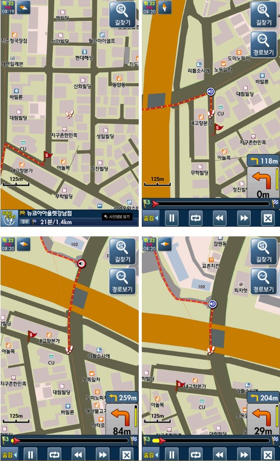
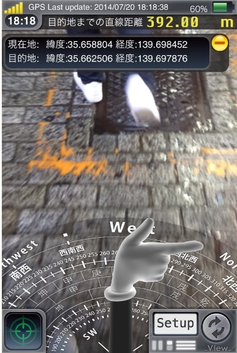

I luv synth
------------------------
----------


> **kind**

> - moog
> - roland
> - arturia


* moog
* roland
* arturia


* 인라인 링크 [cuonet](http://www.cuonet.com/).
* 참조 링크 [lalala] [1].

[1]:###code

YOLO
--------------------

To make a synth
###price list

| Item     | Value | Qty   |
| :------- | ----: | :---: |
| OSC | $600 |  3   |
| Reverb    | $120   |  2   |
| Filter   | $310    |  2  |


### code 


```
// Foo
var bar = 0;
```


### Table of contents

You can insert a table of contents using the marker `[TOC]`:

[TOC]


The *minimoog* is being made by Moog music.


> **MOOG is Great.**
### Support moog

[](https://monetizejs.com/authorize?client_id=ESTHdCYOi18iLhhO&summary=true)

mmmmmmmmmmmmmmmmmmmmmmmmmmmmmmmmmmmmmmmmmmmm

##1. 문제상황(실제 사례) - 타지에서 대중교통파악불능##
1)
> [구글 지도] [오전 3:18] 네이버지도봐도
> - [구글 지도] [오전 3:18] 내가어딨는지모르겠음
> - [아이나비] [오전 3:18] 딱 내리는 곳에서 nfc나 qr찍으면
> - [아이나비] [오전 3:18] 바로 뜨는거
> - [다음 로드뷰] [오전 3:18] 응응
> - [아이나비] [오전 3:18] 주변에 머가 있고
> - [아이나비] [오전 3:18] 딱딱 나오는거
> - [아이나비] [오전 3:18] 어때
> - [다음 로드뷰] [오전 3:18] ㅇㅇㅇㅇㅇㅇ
> - [다음 로드뷰] [오전 3:18] 그럼 되지
> - [아이나비] [오전 3:18] 오
> - [다음 로드뷰] [오전 3:18] 아주 좋네요
> - [아이나비] [오전 3:18] 그래서 내가 지정한 곳으로
> - [아이나비] [오전 3:18] 이끌어주는거야
> - [다음 로드뷰] [오전 3:18] 그걸로 밀고 나가!
> - [아이나비] [오전 3:18] qr코드찍으면서
> - [다음 로드뷰] [오전 3:18] 응응

2)
> [구글 지도] [오전 3:14] 다른지역갔는데
> - [구글 지도] [오전 3:14] 대중교통
> - [구글 지도] [오전 3:14] 1도몰라서
> - [다음 로드뷰] [오전 3:14] 아 맞아
> - [다음 로드뷰] [오전 3:14] ㅇㅈ
> - [구글 지도] [오전 3:14] 택시타고다니는거
> - [다음 로드뷰] [오전 3:14] 그거 졸라 싫어
> - [파인 드라이브] [오전 3:14] ㅇㅈ

3)
> [다음 로드뷰] [오전 3:16] 목포 버스 어플은 위치가 너무 부정확해
> - [구글 지도] [오전 3:16] 대전버스어플도
> - [다음 로드뷰] [오전 3:16] 나 그래서 정류장 5개나 더 감
> - [다음 로드뷰] [오전 3:16] ㅡㅡ
> - [구글 지도] [오전 3:16] 부정확해
> - [다음 로드뷰] [오전 3:16] 목포였는데
> - [다음 로드뷰] [오전 3:16] 졸라 걸어서 한참 걸어갖고
> - [다음 로드뷰] [오전 3:16] 겨우 감
> - [구글 지도] [오전 3:17] 그래서 모르는곳은
> - [구글 지도] [오전 3:17] 나도 대전에서 택시탔어
> - [다음 로드뷰] [오전 3:17] 버스 방향도 제대로 좀 알랴줬으면 좋겠음
> - [다음 로드뷰] [오전 3:17] 1도 모르겠어
> - [구글 지도] [오전 3:17] 길치를위한
> - [구글 지도] [오전 3:17] ㅋㅋㅋㅋㅋㅋㅋㅋㅋㅋㅋㅋㅋㅋ
> - [다음 로드뷰] [오전 3:17] 이 방향으로 가는 게 맞는 건지 모르겠음
> - [다음 로드뷰] [오전 3:17] ㅇㅇㅇ
 
##2. 5Whys##
> 


##3. 필요성##
> 1)	21세기 정보화 시대에 걸 맞는 시간절약과 에너지 절약을 하기 위함
> - 2)	그 누구보다 빠르게 도착하기 위함
> - 3)	누구 보다 빠르게 난 남들과는 다르게 지도 위에 완벽한 나그네가 되기 위함
> - 4)	비싸디 비싼 택시를 타지않음으로써 경제 성장력을 키우기 위함

##4. 요구사항##
> 1)	타 지역에 갔을 때 주변 대중교통수단에 대해 알 수 있어야한다.
> - 2)	언제 어디서 어떻게 오는지 한 번에 알고 싶다.
> - 3)	버스가 언제 어느 방면에서 오는지 버스가 정류소에 도착까지 남은 시작을 알고싶다.
> - 4)	지도 어플들과 연동이 되었으면 좋겠다.
> - 5) 비둘기 보다 실현 가능한 어플이여야 한다.

##5. 해결책 아이디어 도출##
> 1)	정류장마다 체크포인트(qr코드 or nfc)를 설치하여 현재 상황을 쉽게 파악
2)	지도와 연동 후 지하철과 버스상황을 실시간으로 보여준다.

##6.유사한 문제 해결 방법##
1)	보행자 네비게이션 – 걸음길 도우미
-	서울 특별시에서만 가능 하지만 보행자들만을 위한 어플이다. 하지만 대중교통에 대해서는 여느 어플과 같이 가는 경로와 몇 번을 타면 되는지만 알려줄 뿐이다. 그저 사람이 걸어다니는 길로 표현해 놨을 뿐이다.

 

2)	指さしナビ
-	사진에 첨부한 것과 같이 가는 방향을 손가락으로 가리켜주며 현 나의 위도와 경도를 보여준다. 이는 매우 편리한 기능이다. 하지만 일본 일정 지역만 사용 가능하며 가독성이 떨어진다. 나는 그저 손가락이 가리키는 대로 폰만 보며 걸어가야 하고 데이터를 계속 켜놓은 상태로 다녀야 하기에 데이터 부담이 심히 걱정된다.


